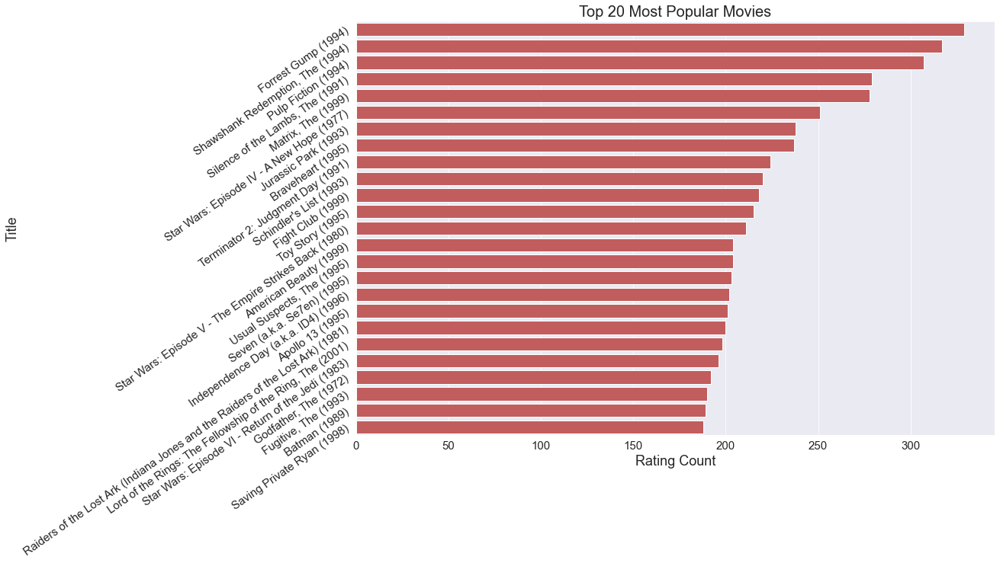
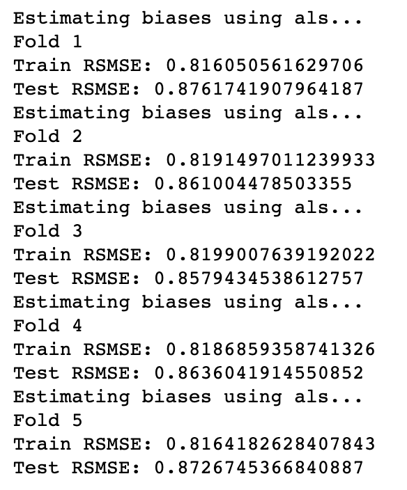

# MovieLens Recommendation System 

**Author:** Jack Mannix

## Summary 

A movie recommendation system that utilizes collaborative-based filtering (CBF) to make tailored suggestions for existing users, and new users. 

## Data and Methods 

This model was built using the [MovieLens 100k Dataset](https://grouplens.org/datasets/movielens/), provided by GroupLens Research
- Users: 610
- Movies: 9724 (up to 2018 releases) 
- Rating Scale: 0.5 - 5
- Prediction Model = BaselineOnly
    - Evaluation Metric = RMSE

---------------------------------------------------------------

# Process 

## EDA

- Determined the top 20 viewed/rated films 

 

## Modeling 

### Comparing Baselines

The final prediction algorithm was chosen on a basis of baseline performance:

- BaselineOnly : 0.8
- SVD :0.87362
- SVDpp : Too computationally expensive (runtime > 45 minutes)
- NMF : 0.92127
- SlopeOne: 0.90104
- CoClustering: 0.94173

Given the overwhelming amount of literature discussing the top performance of SVD, it was curious that BaselineOnly was able to outperform it (by a very small margin)
- I am assuming BaselineOnly's performance can be credited to its use of Alternating Least Squares (ALS) to compute predicitons

### Optimizing BaselineOnly (GridsearchCV)

Final Parameters :
- reg_i = 5
- reg_u = 5
- n_epochs = 30

Best RMSE from KFold:

## Recommendation System Prototype

### Addressing the 'Cold Start Problem'

**ASSUMPTION**

Most Popular = Most Rated

The Cold Start Problem '... concerns the issue that the system cannot draw any inferences for users or items about which it has not yet gathered sufficient information.'(Wikipedia)

This recommendation system prototype uses simple user input to overcome the Cold Start Problem. By asking for the users top 2 movie genres and their least preferred genre, the prototype will suggest the top 5 popular movies meeting the specified criteria. If the user has not seen a given movie, they may enter 'n' to recieve a new movie. This process continues until the new user has rated 5 movies, at which point the recommendation system will recommend 5 new movies based on the user's initial ratings. The prototype can continue until all 9724 movies have been rated; however, the user has the option to continue rating or stop the recommendations after each round of recommendations.
 

### Prototype Demo

<a href="{https://youtu.be/mOfCqTl6sL0}" title="Link Title">
---------------------------------------------------------------

# Going Forward

## Further Investigation 

- Incorporate a content-based solution for the Cold Start Problem
- Explore more complex algorithms (NLP, Neural Networks, etc.), and their combined functioning (hybrid systems)
- Construct a Graphical User Interface (GUI) for a more intuitive user-friendly experience 

---------------------------------------------------------------

# Further Information

For further information regarding the analysis, please view the [Jupyter Notebook](final_notebook.ipynb) or review the findings presentation [HERE](mannix_phase_4_presentation.pdf) 

